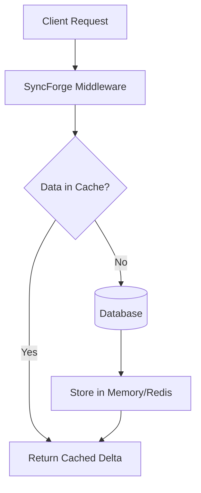
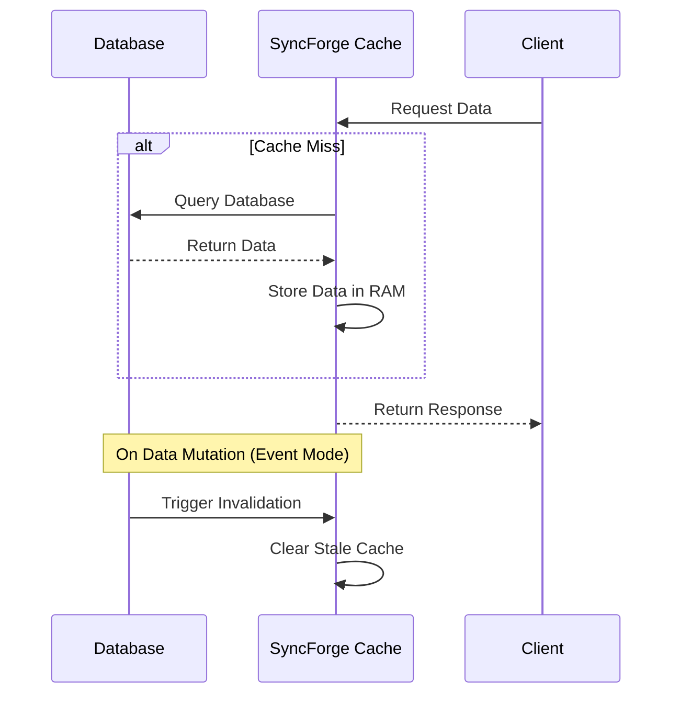

<div align="center">
  
  <h1>SyncForge</h1>
  <p><b>The Developer-Controlled Smart Data Synchronization Platform</b></p>
  <p>
    <a href="https://syncforge.dev/docs/">Documentation</a> •
    <a href="https://syncforge.dev/dashboard/">Dashboard</a>
  </p>

  
  
  
</div>

---

SyncForge is a flexible cache-aside synchronization framework built for modern Python environments. It provides intelligent data synchronization across clients, aiming to drastically reduce database reads for highly static or periodically updated data.

Instead of relying solely on arbitrary time-to-live (TTL) expiration, SyncForge allows developers to decide exactly when data becomes stale, pushing updates instantly to connected systems.

## 🚀 Why Use SyncForge?

SyncForge is engineered to minimize database query volume by intelligently managing cached datasets in application memory.

**Ideal Use Cases:**
- E-Commerce Product Catalogs
- Blog Articles and Static FAQs
- Global Configuration Settings
- Category and Country Lists
- Admin Dashboards & Reporting

**When NOT to use SyncForge:**
- Highly dynamic real-time data (Live Chat, Multiplayer Games)
- Stock Market Tickers
- Frequently changing user session data

### Request Flow Architecture



## 🔒 Security & Performance Features

### 1. Near-Zero Database Reads
By leveraging application-level caching, you can serve thousands of concurrent requests from memory without hitting your primary database for read operations.

### 2. Built-in Rate Limiter
Protect your endpoints from brute-force cache-busting attacks. The built-in rate limiter monitors IP addresses and automatically returns `429 Too Many Requests` when access limits are breached.

### 3. Lightweight Request Inspection
Included in the Python SDK is a lightweight middleware designed to inspect request payloads for common attack vectors, providing an additional layer of security before requests reach your views.

### 4. Zero-Data Architecture
SyncForge central servers only synchronize metadata (table names, timestamps, and HMAC signatures). Your actual database query results and proprietary customer data remain strictly within your local infrastructure.

### 5. Enterprise Cache Engine (v1.2+)
Features `disk_only` storage by default to protect your server's RAM from exhaustion, with **AES-256 encryption enabled out of the box** to ensure complete privacy and compliance for your cached data.

### 6. AI Agent Ready
Easily integrate SyncForge into any project using our [AI Setup Prompt](https://syncforge.dev/docs/ai-prompt/). Just paste the prompt into Cursor, GitHub Copilot, or Antigravity IDE, and let the AI automatically write the cache-aside integration code for you!

## 📂 Project Structure

- **`config/`**: Core Django settings configured for high-concurrency environments.
- **`core/`**: Main frontend marketing templates and documentation sections.
- **`dashboard/`**: The developer portal for managing API keys and table synchronization configurations.
- **`api/`**: High-speed REST API endpoints for SDK communication.
- **`sdk/`**: Python SDK library source (published on PyPI).

---

## 💻 Installation

Install via pip:

```bash
pip install syncforge
```

## ⚡ Quick Start (Django Example)

### 1. Initialize

```python
import os
from syncforge import SyncForge

sf = SyncForge(api_key=os.environ.get('SYNCFORGE_API_KEY'))
```

### 2. Auto-sync Models

```python
from myproject.sf import sf
from syncforge.django import sync_model
from django.db import models

# SyncForge automatically handles invalidation upon save() or delete()
@sync_model(sf, sync_mode='event', storage_mode='disk_only', encryption=True)
class Product(models.Model):
    name = models.CharField(max_length=100)
    price = models.DecimalField(max_digits=10, decimal_places=2)
```

### Cache Lifecycle Diagram



---

## ⚙️ Standalone SDK Refresh & Rate Limiting

### 1. Standalone SDK Refresh
You can trigger cache invalidation from standalone Python scripts outside the main web application (e.g. in cron jobs or microservices) using the SDK and your API key:
```python
import os
from syncforge import SyncForge

# Initialize the SyncForge client standalone
sf = SyncForge(api_key=os.environ.get('SYNCFORGE_API_KEY'))

# Trigger cache refresh from anywhere
sf.refresh('products')
```

### 2. Anti-Spam Rate Limiting (60-Second Cooldown)
To protect your application and database from request spikes, table refreshes are subject to a **60-second cooldown period** per table:
- Rapid consecutive refresh requests (via SDK or the dashboard manual refresh button) within 60 seconds will return an `HTTP 429 Too Many Requests` error.

### 3. Project-Scoped Table Isolation
Table names are isolated by project prefix to avoid collisions across different applications or environments. The SDK and API calculate a prefix like `sf_{project_prefix}_{table_name}` based on your API key, ensuring complete key isolation.

---

## 📖 Documentation & Support

Comprehensive guides for Django, FastAPI, and Flask are available at:

**[https://syncforge.dev/docs/](https://syncforge.dev/docs/)**

Please review our [Contributing Guidelines](CONTRIBUTING.md) to learn how to open issues or submit pull requests.

## 📄 License

MIT License. See `LICENSE` for details.
