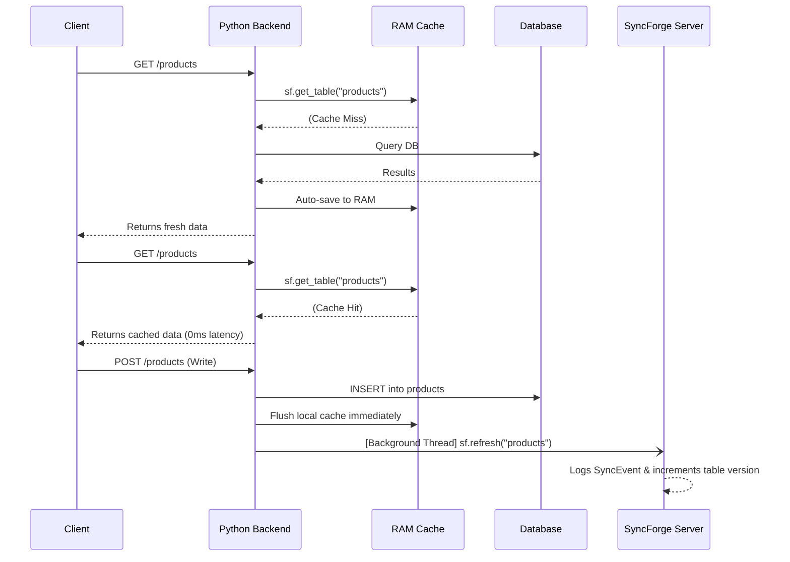

# SyncForge Python SDK

[](https://pypi.org/project/syncforge/)
[](https://pypi.org/project/syncforge/)
[](LICENSE)

**SyncForge** is an enterprise-grade hybrid cache synchronization engine and Web Application Firewall (WAF) designed for Python backends (Django, FastAPI, Flask, SQLAlchemy). 

It eliminates database bottlenecks by intelligently serving previously fetched data from high-speed memory until you explicitly signal that the underlying data has changed. 

> **Core Philosophy**: The developer controls when data becomes stale — not a TTL clock.

---

## Why SyncForge?

- **Zero-Latency Reads**: Instantly serve cached payloads from RAM or AES-256 encrypted disk.
- **Cache Stampede Protection**: Built-in Stale-While-Revalidate architecture utterly bypasses P99 block latency during peak traffic spikes.
- **Intelligent Heat Engine**: Dynamically profiles RAM footprint (safe 256MB boundary), assigning heat scores to keep hot data in memory and gracefully flush cold data.
- **Auto-Maintenance**: The 4 AM IST ultra-fast middleware automatically garbage-collects expired memory and disk files with zero performance overhead.
- **Integrated WAF**: Block SQLi, XSS, and Path Traversal out-of-the-box using the `SyncForgeSecurityMiddleware`.

---

## How It Works (Workflow Architecture)

SyncForge intercepts database reads via the Cache-Aside pattern and database writes via Signals or Manual Refreshes.



---

## Installation

SyncForge is built entirely on the Python Standard Library (`urllib`, `json`, `threading`, `hashlib`, `hmac`), ensuring zero dependency conflicts.

```bash
pip install syncforge

# Optional framework integrations:
pip install syncforge django
pip install syncforge fastapi uvicorn
pip install syncforge flask
```

---

## Quick Start (The Cache-Aside Pattern)

### 1. Initialize the Client
Create a dedicated `sf.py` file in your project root and import `sf` everywhere.

```python
import os
from syncforge import SyncForge

sf = SyncForge(
    api_key=os.environ['SYNCFORGE_API_KEY'],
    silent=True,           # Log warnings instead of crashing on network issues
    async_mode=True,       # All sync events run in background daemon threads
    encryption_key="...",  # (Optional) 32-byte AES-256 key for disk cache encryption
)
```

### 2. Read with Cache (Views/Routes)
SyncForge uses a smart 3-step pattern. Cache keys are **auto-generated securely via query hashing**, meaning you never need to manually handle or spoof `cache_key` parameters.

```python
# 1. Check RAM / Disk cache instantly (0 latency)
cached_data = sf.get_table('core_product')

if cached_data:
    products = cached_data
else:
    # 2. Cache Miss: Query DB, SyncForge saves result automatically
    products = sf.cache_query(
        table_name='core_product',
        queryset=Product.objects.filter(active=True), # Or SQLAlchemy / Raw SQL
        timeout=3600,   # 1 Hour TTL fallback
    )
```

### 3. Invalidate on Write (Manual)
If you aren't using framework signals, manually refresh the cache after any database write.

```python
db.execute("INSERT INTO core_product ...")
sf.refresh("core_product")
```

### 4. Local Development (Offline Mode)
For local development, you can completely bypass network calls to the SyncForge API. This ensures zero server load and allows you to work entirely offline.

```python
# Pass dev_mode=True. API Key is automatically bypassed.
sf = SyncForge(dev_mode=True, backend='in_memory')
```

When `dev_mode` is enabled, all requests (like `refresh` or `create_table`) are intercepted. Instead of hitting the network, SyncForge will print a clear, structured JSON response directly to your local terminal, so you can verify exactly what your application is doing:

```json
🌐 [SyncForge Local Dev] Simulated Network Request
► METHOD: POST
► URL:    https://syncforge.dev/api/v1/sync/core_product/
◄ RESPONSE: {
  "success": true,
  "status": "ok",
  "table": "core_product",
  "project": "local_project",
  "database_calls_saved": 0,
  "message": "[Dev Mode] Sync Triggered",
  "data": {
    "action": "refresh",
    "table": "core_product"
  }
}
```

---

## Framework Integrations

### Django Integration
SyncForge provides native Django signals and security middlewares.

**1. `@sync_model` Decorator**
Hooks into Django's `post_save` and `post_delete` signals to auto-invalidate caches on writes.

```python
# models.py
from django.db import models
from myproject.sf import sf
from syncforge.django import sync_model

@sync_model(sf, sync_mode='event', storage_mode='ram_disk')
class Product(models.Model):
    name = models.CharField(max_length=200)
    
    class Meta:
        db_table = 'core_product'
```

**2. Middlewares (Security & Maintenance)**
```python
# settings.py
MIDDLEWARE = [
    'django.middleware.security.SecurityMiddleware',
    'syncforge.middleware.SyncForgeSecurityMiddleware',      # WAF + Security Headers
    'syncforge.middleware.SyncForgeMaintenanceMiddleware',   # 4 AM IST Auto Cleanup
    # ...
]
```

### FastAPI Integration
```python
import os
from fastapi import FastAPI
from syncforge import SyncForge
from syncforge.fastapi import SyncForgeMaintenanceMiddleware

sf  = SyncForge(api_key=os.environ['SYNCFORGE_API_KEY'])
app = FastAPI()

# Registers the 4 AM Maintenance Cleanup
app.add_middleware(SyncForgeMaintenanceMiddleware, sf_client=sf)

@app.get("/products")
async def get_products():
    cached = sf.get_table("products")
    if cached: return cached
    
    data = sf.cache_query("products", queryset=await db.fetch_all("SELECT * FROM products"))
    return data
```

### Flask Integration
```python
from flask import Flask
from syncforge import SyncForge
from syncforge.flask import SyncForgeFlask

sf  = SyncForge(api_key=os.environ['SYNCFORGE_API_KEY'])
app = Flask(__name__)

# Automatically registers the WAF and Maintenance hooks
sf_ext = SyncForgeFlask(app, sf)
```

---

## Detailed API Reference (A to Z)

### `SyncForge(...)`
Initializes the main engine client.
- **`api_key`** `(str)`: Required. Your SyncForge project API key starting with `sf_live_`.
- **`backend`** `(str)`: Default `'memory'`. Supports `'django_cache'` or `'redis'` for multi-worker environments.
- **`silent`** `(bool)`: Default `False`. If `True`, network errors are caught and logged as warnings instead of crashing the app.
- **`async_mode`** `(bool)`: Default `False`. If `True`, network calls in `refresh()` run in fire-and-forget background threads.
- **`encryption_key`** `(str)`: Optional 32-byte secret. Enables military-grade AES-256 encryption on all local disk cache files.
- **`sign_requests`** `(bool)`: Default `True`. Protects outgoing API requests with HMAC replay attack signatures.

### `sf.cache_query(table_name, queryset, timeout=None)`
Executes a database query ONLY if the cache is empty. The cache key is securely auto-generated using a SHA-256 hash of the `queryset` structure.
- **`table_name`** `(str)`: The unique identifier for the database table.
- **`queryset`** `(Iterable | Callable)`: The Django Queryset, SQLAlchemy query, or raw data to execute/cache.
- **`timeout`** `(int)`: Time-to-Live in seconds. Pass `None` for permanent caching (invalidated only via `refresh()`).
- **Returns**: A standard Python `list` containing the exact payload returned by the database.

### `sf.get_table(table_name)`
Instantly fetches pre-warmed data from local RAM. Triggers the Intelligent Heat Engine to profile RAM usage.
- **`table_name`** `(str)`: The unique table identifier.
- **Returns**: Cached data if available, otherwise `None`.

### `sf.refresh(*tables)`
Signals the SyncForge server to invalidate cache for the given table(s) across all active nodes.
- **`*tables`** `(str)`: Variable length string arguments (e.g., `"users"`, `"products"`).
- **Returns**: `SyncResult` object containing `.ok` (bool), `.calls_saved` (int), and `.version_number` (int).

### `@sync_model(sf_client, table_name, sync_mode, storage_mode, encryption)`
A decorator for Django ORM models to automate caching and invalidation signals.
- **`sync_mode`** `(str)`: `'event'` (sync on every DB write) or `'manual'` (requires explicit refresh).
- **`storage_mode`** `(str)`: `'ram_disk'` automatically preloads data from disk to RAM.
- **`encryption`** `(bool)`: Forces at-rest AES encryption for this specific model.

---

## Production Best Practices

1. **Multi-Worker Environments (Gunicorn/uWSGI)**: When running multiple workers, local RAM cache (`LocMemCache`) is not shared. You MUST configure **Redis** as your backend so that when Worker 1 calls `sf.refresh()`, Worker 2 and 3 caches are properly invalidated.
2. **Never Commit API Keys**: Always read `api_key` from OS environment variables.
3. **Sensitive Data**: Avoid caching plaintext PII, Auth Tokens, or Passwords. If required, always initialize `SyncForge` with an `encryption_key`.

---

## License

MIT — see [LICENSE](LICENSE)
